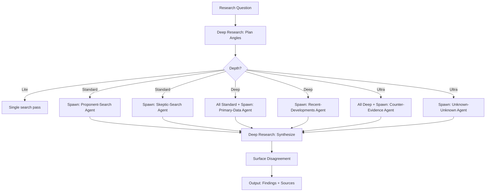

# Deep Research

## Overview

A default web_search-and-answer pass tends to grab whatever's on the first page of results and synthesize it into a confident-sounding answer — quietly laundering a single source's framing, missing disagreement, or missing recent developments. Deep Research makes the research process visibly more rigorous: multiple independent angles, explicit surfacing of disagreement, and honesty about what's still uncertain.

### Core Philosophy

- **Multi-angle, not single-source** — Every open question gets examined from at least two distinct perspectives
- **Surface disagreement explicitly** — When sources conflict, say so directly rather than smoothing it over
- **Never fabricate** — If something can't be verified, say that plainly. A flagged gap is more useful than a confident guess
- **Scale to stakes** — A simple fact check doesn't need this skill; a significant purchase or contested claim does
- **Source attribution** — Always cite what you find; don't present researched claims and invented claims with same confidence

### When to Use

| Scenario | Depth | Example |
|----------|-------|---------|
| Simple fact check | Lite | "What's the capital of Mongolia?" (don't use this skill) |
| Open question | Full | "Tell me about [complex topic]" |
| Contested claim | Full | "What's actually true about X?" |
| Significant purchase | Full/Ultra | "Is this product worth it? What do real reviews say?" |
| High-stakes decision | Ultra | "Should I invest in this technology?" |

---

## Mode System

| Depth | Passes | Research Depth | When to Use |
|-------|--------|---------------|-------------|
| **Lite** | 1-2 passes. Single angle. Minimal search. | Surface-level | Simple, single-fact questions. Skip this skill entirely for trivial queries. |
| **Standard** | 3-4 passes. Steelman + skeptic + primary data. Source triangulation. | Moderate | Most research requests. Default for open questions. |
| **Deep** | 4-6 passes. All four angles + additional domain-specific passes. Exhaustive search. | Deep | High-stakes decisions, contested claims, significant purchases. |
| **Ultra** | 6+ passes. All passes + counter-search every major claim + expert-level sources + unknown-unknown search. | Exhaustive | Academic research, professional reports, life-changing decisions. |

### The Four Research Angles

| Angle | Purpose | What to Search For |
|-------|---------|-------------------|
| **Steelman/Proponent** | The strongest case for one side or interpretation | Supporting evidence, success stories, best-case data |
| **Skeptic/Critic** | The strongest case against, main objections | Critiques, failure stories, limitations, counterarguments |
| **Primary Data** | Original data, studies, filings, specs | Raw data, peer-reviewed papers, official documents, API docs |
| **Recent Developments** | What's changed or been reported most recently | News, changelogs, recent publications, updates in last 6 months |

---

## Subagent-Supported Workflow



### Sub-Agent Roles

| Sub-Agent | Responsibility |
|-----------|---------------|
| **Research-Proponent** | Search for supporting evidence, best-case data, pro arguments |
| **Research-Skeptic** | Search for critiques, failure stories, counterarguments |
| **Research-Primary-Data** | Search for original sources, raw data, primary studies |
| **Research-Recent-Dev** | Search for recent developments, changes, updates |
| **Research-Counter-Evidence** | Search specifically for disconfirming evidence (Ultra) |
| **Research-Unknown-Unknown** | Identify categories of risk/info not yet considered (Ultra) |

---

## Workflow

### Step 0 — Ask About Output Format

Before any research: "Want this as a report you can keep, or just a thorough answer here in chat?" Don't default to either.

### Step 1 — Plan Research Angles

For the specific question, determine which angles fit:
- A factual comparison → Spec sheet pass + real-world reviews + recent changes
- A contested claim → Steelman + skeptic + primary data + recent developments
- A purchase decision → Pro reviews + user reviews + alternatives + durability/longevity

### Step 2 — Execute Research Passes

For each pass:
1. State the angle being taken
2. Search with queries designed for that angle
3. Save findings per angle

**Execution strategy**: In environments with subagent support (`spawn_agents`), run research passes in parallel for faster results. In single-agent environments, run passes sequentially, stating each angle as you go. Either way, all planned angles must be covered before synthesis.

### Step 3 — Source Triangulation

Cross-reference claims across multiple independent sources. Different methodologies arriving at the same conclusion increases confidence.

### Step 4 — Surface Disagreement Explicitly

When sources conflict, do NOT silently pick the one that sounds most authoritative. Report the conflict with the likely reason for it.

### Step 5 — Cite and Attribute

Attribute claims to sources without directly reproducing their wording. Don't quote more than a short phrase from any one source.

### Step 6 — Flag Gaps

If something can't be verified after genuine search effort, say that plainly. A flagged gap is more useful than a confident guess.

---

## Deep Scanning Subsystem

### Surface Scan (Quick)
- **Source Check**: Are all claims attributed to named sources?
- **Recency Check**: Are sources current enough for the topic?

### Structural Scan (Moderate)
- **Triangulation Check**: Are key claims supported by 3+ independent sources?
- **Bias Check**: Has confirmation bias been avoided? (Searched for disconfirming evidence?)
- **Disagreement Check**: Are conflicting sources surfaced or smoothed over?

### Deep Scan (Thorough)
- **Source Quality Audit**: Rate each source (primary / secondary / anecdotal / invented)
- **Gap Analysis**: What wasn't found and should have been?
- **Unknown-Unknown Search**: What category of information wasn't considered?

---

## Output Schema

### In-Chat Answer (Default)

Synthesized findings with angles woven together. Not a dump of raw search results. Each claim attributed.

### Markdown Report (When Requested)

```markdown
# Research Report: [Topic]

## Executive Summary
[2-4 sentence synthesis of findings]

## Research Angles Covered
1. **Steelman/Proponent**: [findings]
2. **Skeptic/Critic**: [findings]
3. **Primary Data**: [findings]
4. **Recent Developments**: [findings]

## Key Findings
[organized by topic, not by search]

## Points of Disagreement
[when sources conflict, with likely reasons]

## Confidence Assessment
[what's well-established, what's uncertain, what's unknown]

## Sources Consulted
[organized by credibility tier]

## Gaps & Open Questions
[what couldn't be verified]
```

---

## Reference Files

| File | Purpose |
|------|---------|
| `references/source-evaluation.md` | How to rate source credibility, identify bias, apply SIFT method |
| `references/search-query-design.md` | How to design effective search queries for each research angle |
| `references/research-ethics.md` | Citation rules, copyright awareness, fabrication prevention |

## Validation

- [ ] Output format asked before starting (in-chat vs file)
- [ ] Multiple distinct research angles executed
- [ ] Every significant claim attributed to a source
- [ ] Disagreement between sources surfaced explicitly
- [ ] Gaps flagged rather than guessed
- [ ] Scale matches the stakes of the question
- [ ] Not used for trivial single-fact questions

## Related Skills

- `the-counsel` — For evaluating ideas using research findings
- `/questions` — For interrogating plans using research-backed challenges
